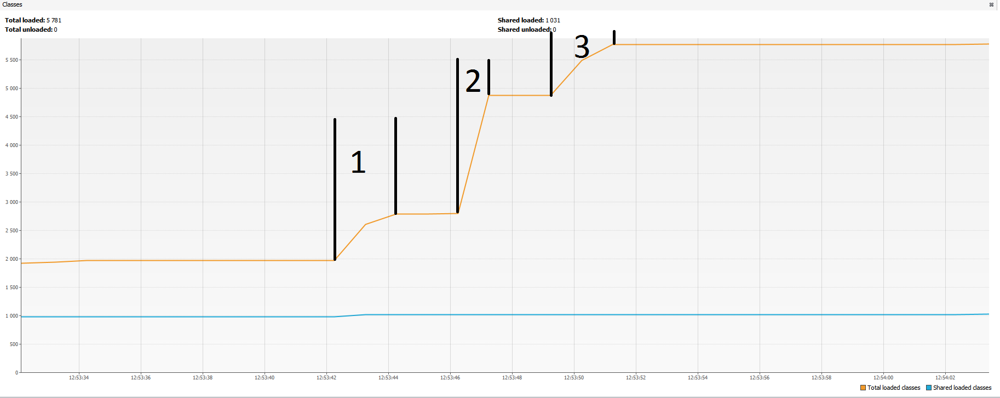
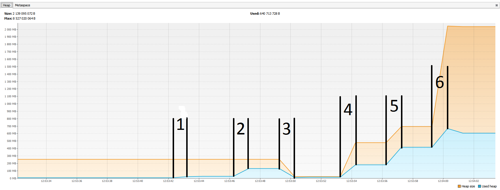
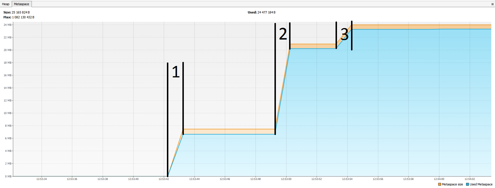

Для облегчения работы, я дополнил код отладочной информацией, а так же присвоил каждой команде номер.

Получило 6 номеров.

На графиках эти команды были помечены

Classes:

Heap:

Metaspace:

Можно заметить, что при импорте класса увеличивается размер метаинфо и количество классов, а также изменяется размер хипа.

А при создании объектов изменяется только размер хипа, но не изменяется размер метаинфо и количество классов.